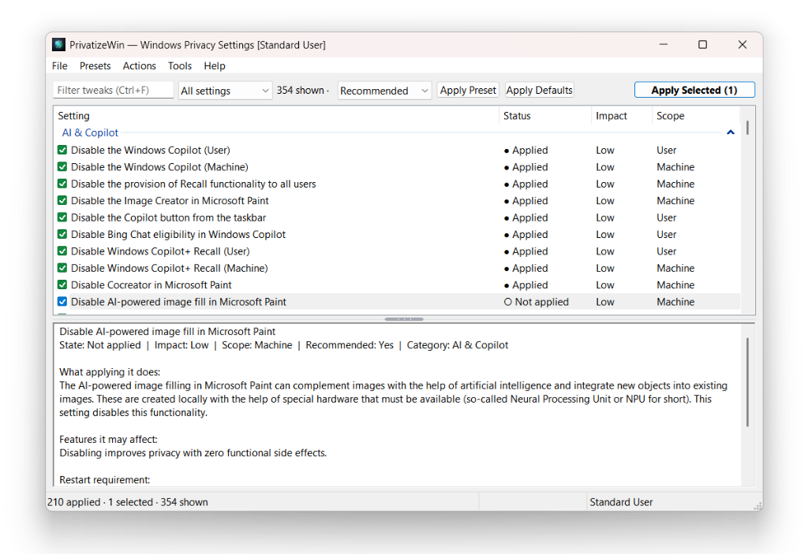

# PrivatizeWin

<div align="center">


### PrivatizeWin
**Modern, Transparent Windows Privacy & Telemetry Silencer**  
*A lightweight, open-source alternative to O&O ShutUp10++ with complete dual GUI and headless CLI.*

[](https://github.com/saverchenkov/PrivatizeWin/actions/workflows/ci.yml)
[](LICENSE)
[](https://en.wikipedia.org/wiki/C%2B%2B20)
[](https://microsoft.com)
[]()
[]()

</div>

---

## 🎯 Why PrivatizeWin?

Recent headlines suggest that [*the future of Windows could include fewer ads and distracting upsells*](https://www.digitaltrends.com/computing/the-future-of-windows-could-include-fewer-ads-and-distracting-upsells/).

**How about no ads and no upsells at all?**

Windows 10 and Windows 11 are powerful operating systems, but out of the box they increasingly treat your PC as a data-harvesting terminal and an ad-delivery network. Diagnostic telemetry, biometric analysis, keystroke tracking, Recall AI desktop snapshot recordings, Copilot integration, Start menu "promoted apps", lock screen advertisements, Edge shopping trackers, and persistent OneDrive/Microsoft 365 upgrade banners run continuously in the background.

While Microsoft provides privacy toggles in the Settings app, they are deliberately fragmented across dozens of convoluted submenus, Group Policy Editor paths, and cryptic registry keys. Worse, **cumulative Windows Updates routinely reset these choices back to factory defaults without notice**.

**PrivatizeWin puts you back in complete control of your operating system:**
* **You Decide:** Control exactly what data Windows transmits to Microsoft servers and what stays strictly on your machine.
* **No Upsells, No Nagware:** Silence promotional suggestions, lock screen ads, dynamic MSN taskbar feeds, and forced cloud migrations with a single click.
* **Stay Privatized Permanently:** Use built-in automated scheduling to re-enforce your privacy configuration in the background, preventing Windows Update from undoing your settings.
* **100% Free & Transparent:** Standalone, portable C++ executable. No installers, no background telemetry, no web wrappers, no third-party ads, licensed under MIT.

---

## 🖥️ Graphical Interface

<p align="center">
  
</p>

* **Non-Destructive Staging:** Applying presets or clicking "Apply Defaults" simply stages checkboxes with color-coded intent badges. Nothing touches your system until you review your selection and click **Apply Selected**.
  * <span style="color:#2ea043">**[✔] Solid Green:**</span> Already active and verified protected on your system.
  * <span style="color:#0969da">**[☑] Solid Blue:**</span> Pending change staged to be applied/protected.
  * <span style="color:#cf222e">**[-] Solid Red:**</span> Pending change staged to be reverted back to Windows defaults.
  * <span style="color:#6e7781">**[ ] Faint Grey:**</span> Not applicable to your current Windows edition or hardware.
* **Compact Draggable Inspector:** Click and drag the centered grip handle to smoothly expand or shrink the lower technical details pane.
* **Rich Setting Inspector:** Instantly inspect why each setting matters, its functional impact (Low, Moderate, High), whether a restart is required, and the exact registry keys and services modified.
* **Fast Filter:** Instant fuzzy search by setting title, category, or registry key (`Ctrl+F`).
* **Presets for Every Need:** One-click presets for **Recommended** (maximum privacy with zero breakage), **Strict Privacy** (hardened privacy for power users), and **Minimal**.
* **Safety First:** Prompts for administrator elevation on-demand only when modifying system-wide machine policies, with built-in System Restore Point creation.

---

## 🚀 Command-Line Interface (CLI)

PrivatizeWin includes a headless, scriptable command-line interface. Passing any command-line argument automatically runs in CLI mode—ideal for sysadmins, enterprise deployments, logon scripts, and CI/CD environments.

### Quick Reference

```bash
# View all available CLI options
PrivatizeWin.exe --help

# Audit current privacy status across all 350+ settings
PrivatizeWin.exe --status

# Output audit in JSON format for automated pipelines
PrivatizeWin.exe --status --output json

# Apply the recommended privacy preset
PrivatizeWin.exe --apply-template recommended

# Test a configuration safely without making changes
PrivatizeWin.exe --apply-template strict --dry-run

# Apply a custom enterprise JSON policy silently
PrivatizeWin.exe --apply-template C:\corp\hardened.json --quiet

# Revert all settings back to Windows factory defaults
PrivatizeWin.exe --revert

# Schedule automatic daily re-enforcement (combats Windows Update resets)
PrivatizeWin.exe --install-task daily --task-template recommended
```

---

### Command & Option Reference

| Option | Argument | Description |
| :--- | :--- | :--- |
| `--status` | *None* | Audits all catalog settings and displays their current state (`Applied`, `Not applied`, or `Not applicable`). |
| `--output` | `text` \| `json` | Sets status output format. `text` displays a formatted console table; `json` outputs structured JSON for scripting. |
| `--apply-template` | `<name\|path>` | Applies a privacy profile. Accepts built-in presets (`recommended`, `strict`, `minimal`) or a file path to a `.json` profile. |
| `--list-templates` | *None* | Lists all built-in presets and auto-detected JSON profiles in the current directory. |
| `--revert` | *None* | Reverts all managed privacy tweaks back to standard Windows factory defaults. |
| `--dry-run` | *None* | Simulates execution without making any actual changes to the Windows Registry or services. |
| `--quiet`, `-q`, `--silent` | *None* | Suppresses console output and message boxes. Preserves error exit codes for headless automation. |
| `--users` | `all` \| `current` \| `none` \| `<list>` | Controls user profile targeting (see below). Defaults to `all`. |
| `--install-task` | `daily` \| `logon` \| `weekly` | Registers a recurring background task in Windows Task Scheduler (default trigger: daily at 12:00 PM). |
| `--task-template` | `<name\|path>` | Specifies which template the background scheduled task enforces (default: `recommended`). |
| `--uninstall-task` | *None* | Removes the PrivatizeWin scheduled background task. |
| `--create-restore-point` | *None* | Forces creation of a Windows System Restore Point before applying changes. |
| `--no-restore-point` | *None* | Skips System Restore Point creation (useful in virtual machines or scripted environments). |
| `--help`, `-h`, `/?` | *None* | Prints CLI usage documentation. |

---

### Multi-User Hive Targeting (`--users`)

Unlike basic batch scripts that only touch the current user account, PrivatizeWin can inspect and configure all user profiles across the operating system:

```bash
# Apply to all user profiles (including unloaded profiles and the Default User template)
PrivatizeWin.exe --apply-template recommended --users all

# Apply only to the currently logged-in user session
PrivatizeWin.exe --apply-template recommended --users current

# Skip user settings entirely and apply only machine-wide policies (HKLM & services)
PrivatizeWin.exe --apply-template strict --users none

# Target specific user accounts by username or SID
PrivatizeWin.exe --apply-template recommended --users alice,bob
```

---

### Automated Background Reapplication

Windows Updates frequently restore disabled telemetry services and telemetry keys. PrivatizeWin solves this with built-in Task Scheduler COM integration:

```bash
# Enforce the recommended preset daily at noon
PrivatizeWin.exe --install-task daily --task-template recommended

# Enforce strict privacy every time any user logs on
PrivatizeWin.exe --install-task logon --task-template strict

# Remove the scheduled task when no longer needed
PrivatizeWin.exe --uninstall-task
```

### Exit Codes

| Exit Code | Meaning |
| :---: | :--- |
| `0` | Success. All requested operations succeeded. |
| `1` | Error occurred (invalid arguments, elevation required, or setting failed to apply). |

---

## 📑 Custom Profile JSON Format

Export and import custom configuration profiles directly in the GUI or CLI using standard JSON:

```json
{
  "name": "enterprise-hardened",
  "description": "Hardened privacy baseline for corporate workstations.",
  "tweaks": {
    "TEL_DIAGTRACK": true,
    "TEL_DIAGDATA": true,
    "AI_COPILOT": true,
    "AI_RECALL": true,
    "SRCH_BING_START": true,
    "PRIV_AD_ID": true,
    "PRIV_TAILORED": true,
    "LOCK_SPOTLIGHT_ADS": true,
    "SHELL_PROMOTED_APPS": true,
    "EDGE_SHOPPING": true,
    "WU_DELIVERY_OPT": true
  }
}
```

* Setting keys to `true` applies the privacy protection.
* Setting keys to `false` restores the setting back to the Windows default.
* Profiles are sparse: settings not listed in the file are left untouched.

---

## ⚡ Lightweight, Native Architecture

PrivatizeWin is built with pure native Win32 controls and modern **C++20** (`/std:c++20`, `/permissive-`, `/W4`):
* **No Dependencies:** Compiled as a single static binary (< 1 MB) without .NET, webviews, Electron, or external runtimes.
* **Instant Startup:** Launches in under 50 milliseconds with minimal memory usage (~10 MB RAM).
* **RAII Resource Safety:** Strict adherence to modern C++ resource management with type-safe smart wrappers for all Win32 handles, registry keys, and service handles.

---

## 🛠️ Building from Source

### Prerequisites
* Windows 10 or 11 (x64 or ARM64)
* Visual Studio 2022 (Community or Build Tools) with C++20 support
* CMake 3.20+ and Ninja

### Build Instructions

```powershell
# 1. Clone repository
git clone https://github.com/saverchenkov/PrivatizeWin.git
cd PrivatizeWin

# 2. Configure build environment (from an x64 Developer Command Prompt)
cmake -B build -G Ninja -DCMAKE_BUILD_TYPE=Release

# 3. Compile standalone single executable
cmake --build build --config Release

# Output binary located at: .\build\PrivatizeWin.exe
```

---

## 📄 License

PrivatizeWin is licensed under the [MIT License](LICENSE).
